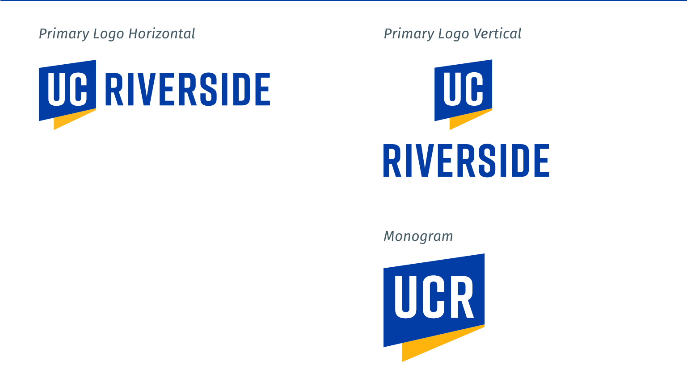

---
output:
  md_document:
    variant: markdown_github
---

<!-- README.md is generated from README.Rmd. Please edit that file -->

```{r, echo = FALSE}
knitr::opts_chunk$set(
  collapse = TRUE,
  comment = "#>",
  fig.path = "figure/",
  fig.height = 1
)
```

# UCR Brand Color Palettes

[](https://travis-ci.org/stajichlab/UCcolors)  




Want to make plots in the [UCR color branding](https://brand.ucr.edu/)?

## Installation

```r
install.packages("UCcolors")
```

__Or the development version__

```r
devtools::install_github("stajichlab/UCcolors")
```

## Usage

```{r, palettes_dummy}
library("UCcolors")

# See all palettes
names(UCR_palettes)
```

## Palettes

### UCR main

```{r, UCRmain}
ucr_palette("UCRmain")
```
